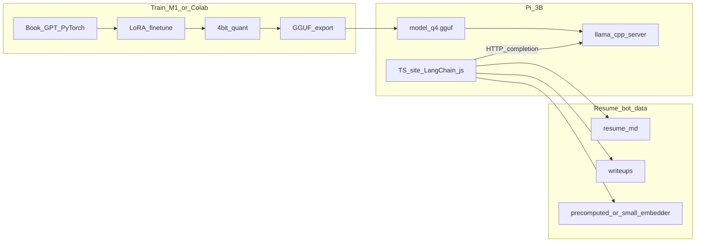
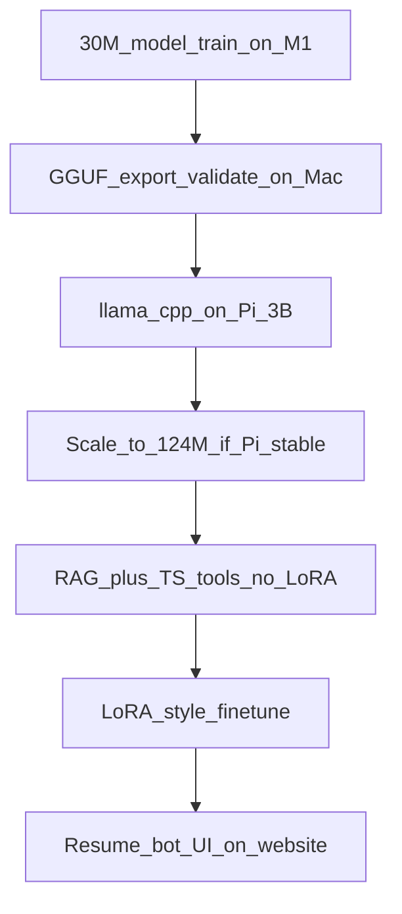

# piLLM: Feasibility and Architecture Plan

## Bottom line: how hard is this?

| Piece | Difficulty | Why |
|-------|------------|-----|
| Implement + pretrain book GPT on M1/Colab | **Medium** | Well-scoped (~124M params); main pain is training stability, data pipeline, and time — not unknown science |
| 4-bit quant + GGUF export | **Medium** | Mature tooling exists; you still need to wire your custom weights into an export path |
| Inference on **Pi 3B (1GB RAM)** | **Hard** | Tight RAM, slow CPU, swap on USB — works for a **small** model with short context, but expect **2–8 tok/s** and careful tuning |
| LoRA on resume + writeups | **Easy–Medium** | Small dataset, short training runs; quality comes from **RAG + tools**, not LoRA alone |
| LangChain tool calling in TypeScript | **Easy–Medium** | LangChain.js keeps TS intact; inference stays a separate HTTP service on the Pi |

**Overall:** This is a **serious but realistic** project if you scope the model small and treat Pi inference as an engineering constraint, not a research problem. The riskiest part is **Pi deployment**, not writing the model.

---

## Hard constraint: Pi 3B memory math

With 1GB RAM (~200–350MB used by OS/services), you have roughly **650–800MB** for inference.

For 4-bit weights: **~0.5 bytes/param** (+ GGUF/llama.cpp overhead ~50–100MB).

| Model size | 4-bit weights | Pi 3B verdict |
|------------|---------------|---------------|
| ~30M (tiny demo) | ~15MB | Comfortable; good first Pi milestone |
| ~124M (book default) | ~62MB | **Target sweet spot** — fits if context ≤512 |
| ~350M | ~175MB | Possible but KV cache + overhead gets tight |
| 1B+ | 500MB+ | **Not realistic** on 1GB without extreme tradeoffs |

KV cache grows with context length (roughly proportional to `layers × heads × seq_len`). Plan for **256–512 max context** on Pi initially.

Swap on a 64GB pen drive avoids OOM but **kills latency** — design so hot path stays in RAM (weights + active KV), not swapped.

---

## Recommended architecture



**Key separation (this is how you avoid “nuking TS”):**

- **Python/PyTorch**: model definition, pretrain, LoRA, quant, export — lives in [`piLLM/src/`](piLLM/src/) (to be created)
- **Pi runtime**: `llama.cpp` binary + GGUF — **not** PyTorch on Pi (PyTorch on Pi 3B is too heavy/slow)
- **TypeScript**: website + [LangChain.js](https://js.langchain.com/) agent/tools — calls `http://127.0.0.1:<port>/completion` (or Ollama-compatible API if you prefer)

LangChain.js handles: tool schemas, routing, memory, RAG retrieval orchestration. The LLM on Pi only generates text; tools run in Node on the Pi (or edge functions if you split later).

---

## Phase breakdown

### Phase 1 — Book model + pretrain (M1 / Colab) — **Medium**

Follow *Building an LLM from Scratch* structure:

- `GPTModel`, causal attention, layer norm, GELU, weight tying
- Tokenizer (BPE, ~50k vocab as in book) — **train the tokenizer on your Dolma subset**, not on full Dolma
- Pretrain on a **Dolma subset** (recommended) or Cosmopedia/OpenWebText sample
- **M1**: use MPS backend; batch size will be small (gradient accumulation)
- **Colab**: T4 free tier works; watch session limits — checkpoint to Drive

#### Pretraining data: Dolma subset — **yes, good choice**

[Dolma](https://huggingface.co/datasets/allenai/dolma) (AI2/OLMo corpus, **ODC-BY** license) is a strong replacement for the book’s OpenWebText-style data.

**Why the Hugging Face page is confusing:** the “Models trained on allenai/dolma” section (OLMo-1B, OLMo-7B, etc.) is **not** data you download — those are models AI2 trained *using* Dolma. The actual data versions are in the README **Versions** table and selected via the `name=` config (see below). Dolma is not hosted as one giant HF file; it lives on `olmo-data.org` as many `.json.gz` shards listed in manifest files under [`urls/`](https://huggingface.co/datasets/allenai/dolma/tree/main/urls).

| Dolma `name=` config | Manifest file | What it is |
|----------------------|---------------|------------|
| `v1_6-sample` | `urls/v1_6-sample.txt` | ~103 mixed shards, ~10B tokens, ~16GB — **only official small sample** |
| `v1_6` | `urls/v1_6.txt` | Full v1.6 corpus — slice by URL grep |
| `v1_7` | `urls/v1_7.txt` | Full v1.7 corpus (~2,420 shards) — **same slicing mechanics, no v1_7-sample** |

**v1_7 vs v1_6:** URL-path slicing works the same way (`grep` manifest → `wget`), but there is **no** `v1_7-sample` on HF — only full `urls/v1_7.txt`. v1_7 adds sources (e.g. `starcoder/`, `falcon-refinedweb-filtered/`, `redpajama-arxiv/`, `tulu_flan/`, `proof_pile_2-*`) and renames some paths (`c4-filtered/` instead of `c4/`, `stack/` → `starcoder/`). Same JSONL schema (`id`, `text`, `source`, …).

```bash
# v1_7 clean starter (same idea as v1_6)
grep -E 'dolma-v1_7/(wiki|books)/' dolma/urls/v1_7.txt > manifest_v17_clean.txt
grep 'dolma-v1_7/pes2o/' dolma/urls/v1_7.txt | head -20 >> manifest_v17_clean.txt
```

**Recommendation for piLLM:** start with **`v1_6` URL slicing** or **`v1_6-sample`** (easier exploration); switch to **`v1_7`** once the pipeline works — higher quality filtering, but you must build your own small manifest (no 16GB sample bundle).

Each JSONL line is one document:

```json
{"id": "...", "text": "...", "source": "...", "added": "...", "created": "..."}
```

The `source` field tags origin inside mixed shards; full `v1_6` also splits shards **by directory** in the URL path.

#### How to slice Dolma (three methods)

**Method 1 — Download only the shards you want (recommended for piLLM)**

Clone the HF repo for the URL manifests, grep by source path, wget selectively:

```bash
git clone --depth 1 https://huggingface.co/datasets/allenai/dolma
mkdir -p data/dolma/raw

# v1_6 source directories (from urls/v1_6.txt):
#   wiki/  books/  pes2o/  c4/  cc_en_head/  cc_en_middle/  cc_en_tail/  reddit/  stack/

# Tiny “clean text” starter (~few GB): all wiki + books + first 20 paper shards
grep -E 'dolma-v1_6/(wiki|books)/' dolma/urls/v1_6.txt > data/dolma/manifest_clean.txt
grep 'dolma-v1_6/pes2o/' dolma/urls/v1_6.txt | head -20 >> data/dolma/manifest_clean.txt

cat data/dolma/manifest_clean.txt | xargs -n 1 -P 4 wget -q -P data/dolma/raw
```

Add web/code later by appending lines matching `c4/`, `cc_en_head/`, or `stack/` — take **first N files**, not entire directories (c4 alone is hundreds of shards).

**Method 2 — Use `v1_6-sample`, filter by `source`, stop at token budget**

Mixed shards only — you slice in software, not by URL folder:

```python
from datasets import load_dataset

ALLOWED = {"wikipedia", "gutenberg", "pes2o"}  # inspect one file first for exact strings
TARGET_TOKENS = 500_000_000  # 500M for smoke test
token_count = 0

ds = load_dataset("allenai/dolma", name="v1_6-sample", split="train", streaming=True)
for doc in ds:
    if doc["source"] not in ALLOWED:
        continue
    token_count += len(doc["text"].split())  # rough; replace with your tokenizer
    if token_count >= TARGET_TOKENS:
        break
    # write doc["text"] to shard / tokenize inline
```

To discover valid `source` values, peek at one downloaded file:

```bash
zcat data/dolma/raw/*.json.gz | head -1 | python -m json.tool
# or count sources:
zcat file.json.gz | python -c "import sys,json,collections; c=collections.Counter(json.loads(l)['source'] for l in sys.stdin); print(c.most_common(20))"
```

**Method 3 — Point HuggingFace at locally downloaded shards**

After wget, avoid re-downloading:

```bash
export DOLMA_DATA_DIR=/path/to/data/dolma/raw
```

```python
ds = load_dataset("allenai/dolma", name="v1_6", split="train", streaming=True)
# reads only files listed in urls/v1_6.txt that exist under DOLMA_DATA_DIR
# so: put ONLY your manifest URLs' files in that dir, or maintain a custom url list
```

#### Recommended piLLM slices

| Phase | What to download | Approx size | Token budget |
|-------|------------------|-------------|--------------|
| Smoke test | all `wiki/` + `books/` + 10× `pes2o/` | ~1–3 GB | 50–200M |
| 30M Pi model | above + 30× `c4/` or `cc_en_head/` | ~5–10 GB | 200M–1B |
| 124M target | staged mix below | ~15–40 GB | 0.5–2B |

**Staged training mix (reproducible):**

1. **Phase A:** `wiki/` + `books/` + `pes2o/` (first 25 shards) — clean prose
2. **Phase B:** add `c4/` (first 50 shards) + `stack/` (first 10 shards) — breadth
3. **Skip early:** `reddit/` (noisy formatting), full Common Crawl tail tiers until base model works

**How much data for a ~124M model?**

Chinchilla-optimal would be ~2–3B tokens, but for Pi + resume-bot phrasing, **0.5–2B tokens** from a curated slice is enough.

**Pipeline steps:**

1. Build `manifest_clean.txt` (or stream-filter `v1_6-sample`) with fixed seed + file list
2. Download shards → `data/dolma/raw/`
3. Train BPE tokenizer on **~100M–500M tokens** from that slice
4. Tokenize → fixed-length `.bin` shards (256–512 tokens) for training
5. Save manifest (URLs, source filters, token count, seed) for reproducibility
6. Attribute Dolma in README (ODC-BY)

**Book vs Dolma caveat:** train your own BPE on your slice; do not use OLMo’s tokenizer.

**Exit criteria:** validation loss decreasing; model generates coherent-ish English at 124M (or start at 30M for faster iteration).

**Time estimate:** 2–4 weeks part-time for first working pretrain (mostly debugging + data, not raw compute).

### Phase 2 — 4-bit quant + GGUF export — **Medium**

You train in PyTorch; Pi runs via export:

1. Save checkpoint (`.pt` / safetensors)
2. Convert to HF-compatible layout if needed (custom script)
3. Use **llama.cpp convert script** or write a minimal converter matching your architecture
4. Quantize to **Q4_K_M** (good size/quality tradeoff)
5. Validate on Mac with `llama-cli` before copying to Pi

**Critical decision early:** align your book architecture with something `llama.cpp` can load, **or** budget time to write/adapt a converter. The book GPT-2-like stack is close to existing GPT-2/GGUF paths — confirm layer names, RoPE vs learned pos embeddings, and vocab before you train for weeks.

**Exit criteria:** same prompt produces similar output on Mac PyTorch vs Mac llama.cpp Q4.

### Phase 3 — Pi 3B deployment — **Hard**

On Pi (32GB SD + 64GB USB swap):

- Build `llama.cpp` for **aarch64** with ARM NEON, `-O3`, no unnecessary backends
- Run `llama-server` bound to localhost
- systemd unit for auto-start
- Tune: `-c 256`, `-t 4` (threads), `-ngl 0` (no GPU on Pi 3B)
- Monitor with `htop` + `dmesg` for OOM killer

**Realistic expectations:**

- First token latency: seconds possible on cold start
- Steady state: **~2–8 tokens/sec** for ~124M Q4 (highly implementation-dependent)
- Resume-bot answers (100–200 tokens): **15–90 seconds** — acceptable for a personal site demo if UI shows streaming

**Exit criteria:** stable 100+ generation runs without OOM; website can stream tokens via SSE from your TS server proxying llama-server.

### Phase 4 — Resume bot: LoRA + RAG + tools — **Easy–Medium**

**Do not rely on LoRA alone for facts.** Resume bots hallucinate dates/titles easily.

#### Does a vector DB improve inference?

**No — not directly.** LLM inference (token generation on Pi via llama.cpp) is unchanged whether you use a vector DB, a JSON file, or nothing at all.

What RAG *does* improve is **answer quality**, not inference speed:


Your ~124M model is weak at memorizing facts. RAG injects the right resume/writeup text into the prompt so the model **summarizes and phrases** instead of **inventing** job titles and dates. That is the main quality win — and it matters more than LoRA for factual questions.

#### Vector DB vs simpler storage on Pi 3B

Your corpus is tiny (1 resume + N writeups → likely **50–300 chunks**). At that scale:

| Approach | Pi fit | When to use |
|----------|--------|-------------|
| **In-memory cosine search** (precomputed vectors in JSON/numpy) | Best | Start here; sub-ms search, zero extra RAM |
| **SQLite + sqlite-vss** | Good | LangChain.js friendly; persistent; still lightweight |
| **LanceDB / Chroma embedded** | OK | If you want LangChain retriever abstractions out of the box |
| **Qdrant / Pinecone / Weaviate** | Poor fit | Overkill for personal resume; extra RAM/process on 1GB Pi |

**Recommendation:** use **precomputed embeddings + SQLite-VSS** (or plain in-memory vectors initially). Skip a standalone vector DB server on Pi — it adds RAM and ops complexity without meaningful retrieval gains at your data size.

#### Hybrid retrieval (better than vectors alone)

Vector search alone misses exact matches (“What was your role at Acme Corp?”). Combine:

| Layer | Role | Example |
|-------|------|---------|
| **Structured tools** | Exact facts, no hallucination | `get_resume_section("experience")`, `list_projects()` |
| **Keyword/BM25** | Exact names, dates, company strings | Match “Acme” even if embedding is fuzzy |
| **Vector search** | Semantic questions | “Tell me about distributed systems work” |
| **LoRA** | Tone/format only | First-person, concise, recruiter-friendly |
| **LLM inference** | Synthesize retrieved chunks into prose | Pi llama.cpp |

LangChain.js supports this via `EnsembleRetriever` or routing: try structured tool first for factual queries, fall back to vector search for open-ended ones.

#### Embeddings on Pi 3B

- **Build time (M1/Colab):** embed all chunks once; store vectors on 64GB USB
- **Query time options:**
  1. **Best for Pi:** embed the user query on M1 during dev, or use **keyword-only retrieval** on Pi (no runtime embedder)
  2. **Later upgrade:** tiny ONNX embedder (~30MB) for query embedding only — still much lighter than running generation
- Do **not** run a large embedding model alongside llama.cpp on 1GB RAM unless you measure headroom

**LoRA training:** same PyTorch codebase on M1/Colab; rank 8–16, ~100–500 steps on your corpus; merge or load adapter at export time.

**Data layout (suggested):**

```
data/
  resume.md
  writeups/
    project-a.md
    project-b.md
  finetune/
    instruction.jsonl   # optional SFT pairs
  rag/
    chunks.jsonl        # text + metadata (section, project, dates)
    vectors.sqlite      # sqlite-vss: chunk_id, embedding, fts index
```

### Phase 5 — TypeScript + LangChain.js — **Easy–Medium**

Suggested layout:

```
web/
  package.json          # langchain @langchain/core @langchain/openai (or community)
  src/
    agent.ts            # createToolCallingAgent + AgentExecutor
    tools/              # resume search, section fetch
    llm/piClient.ts     # wraps llama-server HTTP (OpenAI-compatible if enabled)
    server.ts           # Express/Fastify or Next.js API routes
    ui/                 # streaming chat for your site
```

**Pi LLM client:** implement a thin adapter matching llama-server’s API — LangChain.js accepts custom `BaseChatModel` or OpenAI-compatible endpoints. No Python in the web hot path.

**Tool calling caveat:** small ~124M models are **weak at native function calling**. Mitigations:

- Use **ReAct-style** prompt + regex/JSON parsing (LangChain supports this)
- Or structured output prompt (“respond with JSON: `{tool, args}`”)
- Keep tool set **small** (3–5 tools)

This is a known limitation — plan for prompt engineering, not GPT-4-grade tool reliability.

---

## What to build first (order matters)



Prove Pi inference on a **30M toy model** before investing in full 124M pretrain. One OOM on Pi early saves weeks.

---

## Repo structure (greenfield — empty today)

**Data acquisition subplan (raw Dolma v1_7, 100M slice):** [Data Acquisition](data-acquisition.md) — `train_100m_v17.txt` (25 shards, ~63 GB) → `data/dolma/raw/`. Tokenization later.

```
piLLM/
  src/
    model/           # attention, blocks, GPT (book)
    tokenizer/
    train/           # pretrain.py, lora.py, config.yaml
    data/            # dolma_stream.py, tokenize.py, manifest
    export/          # to_gguf.py, verify_parity.py
  data/              # resume, writeups, rag artifacts
  pi/
    deploy.sh        # copy GGUF, systemd, llama.cpp build flags
    llama-server.service
  web/               # TypeScript + LangChain.js
  notebooks/         # Colab-friendly 01_pretrain.ipynb
  requirements.txt
  README.md
```

---

## Risks and mitigations

| Risk | Mitigation |
|------|------------|
| Pi OOM / swap thrashing | Start 30M; cap context; precompute RAG embeddings |
| Custom arch not loadable in llama.cpp | Prototype export on week 1 with random weights |
| LoRA facts wrong | RAG + tools for content; LoRA for tone only |
| Colab time limits | Checkpoint every N steps to Drive; resume training |
| Slow Pi UX | Stream tokens; show “thinking”; cache common answers |
| Tool calling fails on small model | ReAct + 3 tools max; fallback to RAG-only mode |
| Vector DB overhead on 1GB Pi | Precomputed vectors + SQLite-VSS; no separate DB server |
| RAG retrieves wrong chunks | Hybrid retrieval: structured tools + BM25 + vectors; cite sources in UI |

---

## Honest scope statement

- **Writing the LLM yourself:** good learning, doable on M1/Colab for book-scale.
- **Running on Pi 3B:** the **hardest engineering** part — not impossible, but you are optimizing for **smallest viable model + llama.cpp**, not cutting-edge quality.
- **Resume bot on your website:** very achievable if you treat it as **RAG + tools + small local LLM**, with LoRA as polish.
- **LangChain in TS:** straightforward **if** inference is a sidecar HTTP service; do not embed PyTorch into your TS stack.

---

## Success metrics (concrete)

1. **Week 2–3:** 30M model generates text on Pi via llama.cpp Q4
2. **Week 4–6:** 124M pretrain checkpoint exports and runs on Pi at ≥2 tok/s
3. **Week 6–7:** TS site answers “What did you build at X?” using RAG + tools with citations from your writeups
4. **Week 8:** LoRA-tuned tone; streaming UI on your personal site

These are part-time estimates; full-time compresses roughly 2–3x.
